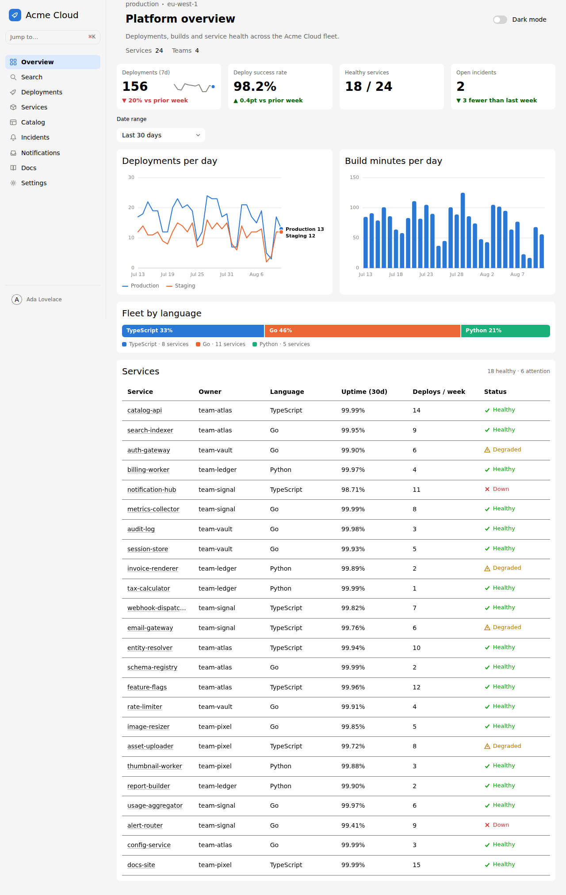

# astro-backstage-ui-experiment

An experiment that builds a multi-page [Backstage UI](https://ui.backstage.io)
(`@backstage/ui`) dashboard on [Astro](https://astro.build).

## Routing

Each sidebar entry is a real Astro page, so every section ships its own HTML
document and its own URL:

| Route | Page | What it shows |
| :---- | :--- | :------------ |
| `/` | Overview | KPI row, deployments line chart, build-minutes columns, fleet split, services table |
| `/deployments` | Deployments | Deploy KPIs, per-environment trend, recent deployments table |
| `/services` | Services | Searchable catalog with owner filter, fleet by language |
| `/incidents` | Incidents | Incident KPIs, incidents-per-week columns, incident log |
| `/settings` | Settings | A form built from the Backstage UI field components |

`src/layouts/DashboardLayout.astro` supplies the shell (sidebar + main) and each
page drops its own island into the slot, so the sidebar and the page content
hydrate independently.

Because every navigation is a fresh document, the theme is persisted to
`localStorage` and re-applied by an inline script in `Layout.astro` **before
first paint** — switching pages never flashes the light theme.

## Deployment

`.github/workflows/deploy.yml` publishes the site to GitHub Pages. It is
triggered by `workflow_run` on a **successful** CI run on `main`, so a build
whose tests failed is never published, and it checks out
`workflow_run.head_sha` so the deployed commit is exactly the one CI validated.
It can also be run manually from the Actions tab.

A project site is served from `https://<user>.github.io/<repo>/`, so the build
needs a base path. `astro.config.mjs` reads it from `BASE_PATH`, which the
workflow fills in from `actions/configure-pages` — that keeps `npm run dev`, the
local build and the Playwright suite on `/` while the deployed site gets the
subpath. Astro rewrites the URLs it generates itself, but not hrefs written by
hand, so the sidebar links go through `withBase()` in
`src/components/dashboard/base.ts`.

> **One-time setup:** in the repository settings, set **Pages → Build and
> deployment → Source** to **GitHub Actions**. The workflow cannot enable this
> for you, and deploys fail until it is set.

## What it uses

From **`@backstage/ui`**: `Header`, `Card` / `CardHeader` / `CardBody`, `Flex`,
`Text`, `Select`, `SearchField`, `Switch`, `Avatar`, `Button`, `TextField`,
`TextAreaField`, `RadioGroup` / `Radio`, `CheckboxGroup` / `Checkbox`, and the
table primitives (`TableRoot`, `TableHeader`, `TableBody`, `Column`, `Row`,
`Cell`, `CellText`).

Where Backstage UI has no component, the gap is filled with
**`react-aria-components`** directly — the same library Backstage UI is built
on, so behaviour and focus handling stay consistent:

| Gap | Built with |
| :-- | :--------- |
| Sidebar navigation | `ListBox` / `ListBoxItem` with `href`, so the items are real links; the active page is the ListBox's controlled selection (react-aria does not forward `aria-current`, and `aria-selected` is what assistive tech reads inside a listbox) |

Charts are hand-rolled SVG/HTML in `src/components/dashboard/charts/` (line,
column, stacked bar, sparkline). They follow a few deliberate rules:

- A fixed categorical palette, validated for colour-blind separation and
  contrast against the real card surfaces in **both** themes — the dark values
  are the same hues re-stepped for the dark surface, not an automatic flip.
- Thin marks, 2px lines, 4px rounded column caps, 2px surface gaps between
  touching fills, and 2px surface rings on overlapping dots.
- A hover/focus tooltip on every chart, a crosshair that snaps to the nearest
  point on the line chart, and keyboard support (arrow keys move the crosshair).
- Axis ticks pick a step that lands on 4–5 gridlines, so a chart of single
  digits is not squashed against a baseline scaled for hundreds.
- Direct labels are measured before they are drawn: a label that would not fit
  is dropped rather than clipped, and the legend still carries it.
- Status is never colour alone — each tone ships with its own icon shape and a
  text label. Severity, being an ordered scale rather than a state, uses a
  ranked dot instead.

## Commands

| Command           | Action                                       |
| :---------------- | :------------------------------------------- |
| `npm install`     | Install dependencies                         |
| `npm run dev`     | Start the dev server at `localhost:4321`     |
| `npm run build`   | Build the production site to `./dist/`       |
| `npm run preview` | Preview the production build locally         |
| `npm run check`   | Type-check with `astro check`                |
| `npm test`        | Run the Playwright tests (build first)       |

The Playwright suite renders every page in both themes and writes the ten
screenshots in `screenshots/`, which are committed to the repository.
