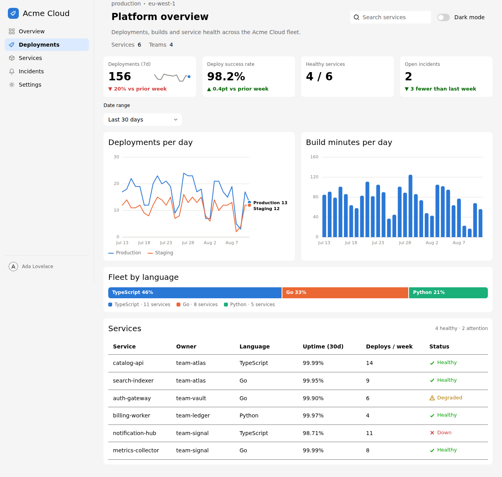

# astro-backstage-ui-experiment

An experiment that renders a full [Backstage UI](https://ui.backstage.io)
(`@backstage/ui`) dashboard on an [Astro](https://astro.build) page.

## How it works

- Astro serves a static page at `src/pages/index.astro`.
- The page hydrates one React island (`src/components/DashboardApp.tsx`) via the
  `@astrojs/react` integration (`client:load`).
- Backstage UI's stylesheet is imported globally in `src/layouts/Layout.astro`
  (`@backstage/ui/css/styles.css`), and the theme is controlled with the
  `data-theme-mode` attribute on `<html>` that the dark-mode switch toggles.

## What the dashboard uses

From **`@backstage/ui`**: `Header` (title, description, tags, metadata,
actions), `Card` / `CardHeader` / `CardBody`, `Flex`, `Text`, `Select`,
`SearchField`, `Switch`, `Avatar`, and the table primitives (`TableRoot`,
`TableHeader`, `TableBody`, `Column`, `Row`, `Cell`, `CellText`).

Where Backstage UI has no component, the gap is filled with
**`react-aria-components`** directly — the same library Backstage UI is built
on, so behaviour and focus handling stay consistent:

| Gap | Built with |
| :-- | :--------- |
| Sidebar navigation | `ListBox` / `ListBoxItem` — keyboard navigable, single-select, styled through its `data-selected` / `data-hovered` / `data-focus-visible` states |

Charts are hand-rolled SVG/HTML in `src/components/dashboard/charts/` (a line
chart, a column chart, a stacked bar and a stat-tile sparkline). They follow a
few deliberate rules:

- A fixed categorical palette, validated for colour-blind separation and
  contrast against the real card surfaces in **both** themes — the dark values
  are the same hues re-stepped for the dark surface, not an automatic flip.
- Thin marks, 2px lines, 4px rounded column caps, 2px surface gaps between
  touching fills, and 2px surface rings on overlapping dots.
- A hover/focus tooltip on every chart, a crosshair that snaps to the nearest
  point on the line chart, and keyboard support (arrow keys move the crosshair).
- Direct labels are measured before they are drawn: a label that would not fit
  is dropped rather than clipped, and the legend still carries it.
- The date-range filter sits in one row above the charts it scopes.

## Commands

| Command           | Action                                       |
| :---------------- | :------------------------------------------- |
| `npm install`     | Install dependencies                         |
| `npm run dev`     | Start the dev server at `localhost:4321`     |
| `npm run build`   | Build the production site to `./dist/`       |
| `npm run preview` | Preview the production build locally         |
| `npm run check`   | Type-check with `astro check`                |
| `npm test`        | Run the Playwright tests (build first)       |

The Playwright suite covers both themes and writes the screenshots in
`screenshots/`, which are committed to the repository.
